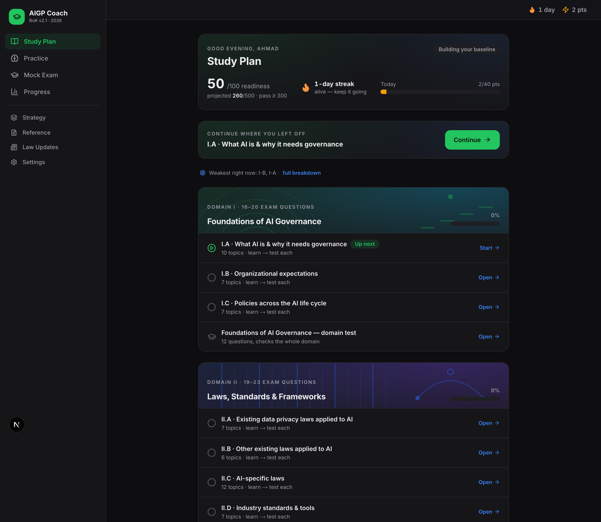
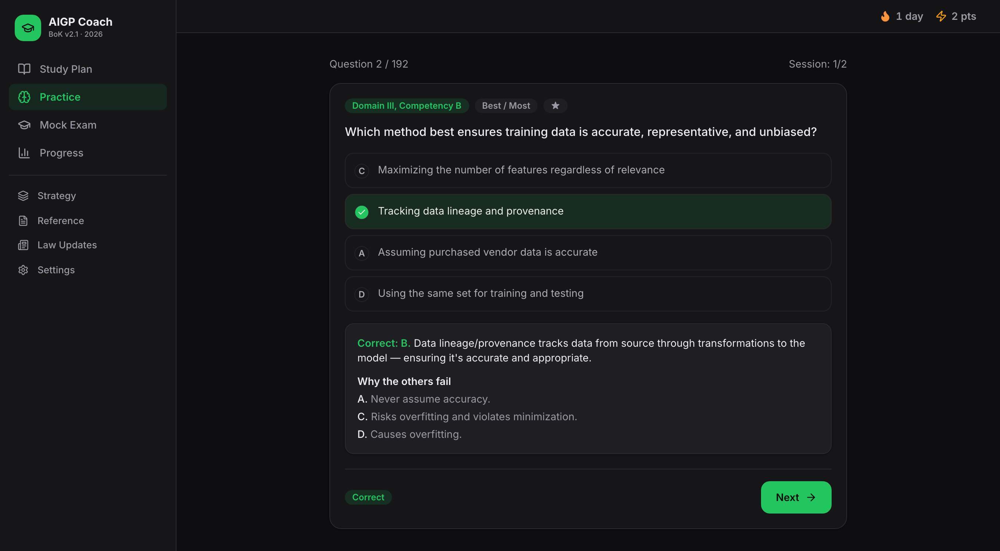
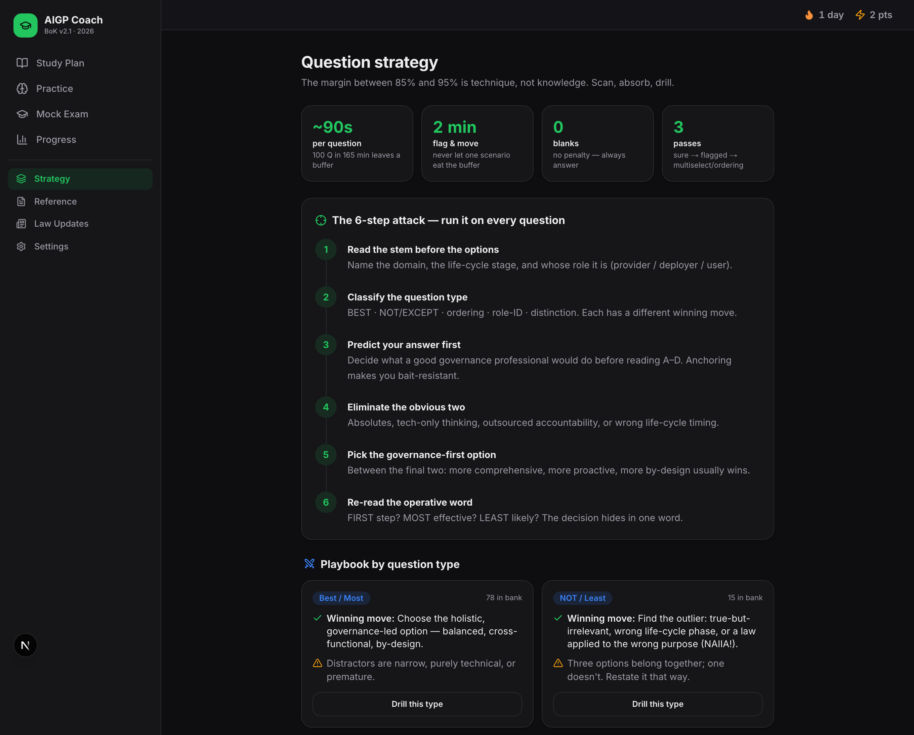

# AIGP Coach

**A study system I built for the IAPP AIGP exam, because the prep material I could buy told me *what* to know and never *why I was getting questions wrong*.**

Live: **[aigp-coach.vercel.app](https://aigp-coach.vercel.app)** · No login, no tracking, works offline after first load.



---

## The problem

I was preparing for the IAPP's AI Governance Professional exam. The material available to me had two gaps I couldn't work around.

The first is that question banks tell you the answer, not the reasoning. You learn that C was right. You don't learn why B was the trap, and you don't learn that you fall for that same trap in every scenario question about deployer obligations.

The second is that AI law does not sit still. The EU AI Act's obligations phase in on different dates, those dates were themselves amended in July 2026, and US state law moves every quarter. A PDF bought in January is misleading by June, and it doesn't tell you which parts went stale.

So I couldn't answer the only question that mattered: **am I ready to sit this exam, and if not, what specifically is wrong?**

## The approach

I built the thing I wanted, and made three decisions that shaped it.

**Diagnose the miss, not just the answer.** Every question carries a rationale, a line on why each wrong option fails, and a trap type. After answering I tag the miss as Knowledge, Technique, or Read-error: I didn't know it, I knew it but attacked the question wrong, or I misread the stem. Those need completely different remedies, and lumping them together is why "just do more questions" stops working.



**Treat exam technique as a separate skill.** Past a certain point the gap isn't knowledge, it's how you read a convoluted stem. So question type is a first-class attribute (Best/Most, NOT/Least, ordering, role-ID, distinction, recall), each with its own playbook and its own drill.



**Make readiness a number with reasons behind it.** The dashboard projects a scaled score against the pass mark and gives a Ready / Almost / Not-yet verdict, then names the competencies dragging it down. Confidence is captured per question, so the analytics can show overconfidence, meaning high certainty with low accuracy, which is the pattern that actually fails people.

## What it does

| | |
|---|---|
| **Learn** | 101 topics mapped to the Body of Knowledge v2.1, plain-English explanations, spaced-repetition flashcards |
| **Practice** | 192 questions, filterable by competency, type, difficulty, unseen, or previously-wrong |
| **Mock exam** | Blueprint-proportional and timed, scaled scoring, per-domain breakdown |
| **Strategy** | Six-step question attack, playbooks and drills per question type |
| **Analytics** | Mastery by competency, Knowledge/Technique/Read-error split, confidence calibration, time per question |
| **Law updates** | A dated feed of what changed, so stale content is visible rather than silent |

Coverage: 4 domains, 13 competencies, 6 question types, 101 topics, 192 questions, 32 flashcards.

**Stack:** Next.js 16, TypeScript, Tailwind v4, Zustand, Recharts. Progress lives in `localStorage`; there are no accounts and nothing is sent anywhere. Supabase is optional, and only so content can be updated without a redeploy.

## Run it

```bash
npm install && npm run dev
```

Fully functional with no configuration, because the content is bundled. Supabase setup and deployment notes are in [DEPLOY.md](DEPLOY.md).

## What I'd do differently

**I built content and product at the same time, and content won.** Roughly two thirds of the effort went into writing questions and topic explanations, not into the app. That was the right call for a study tool with one user, but I'd been telling myself I was building a product. I was building a textbook with a progress bar.

**The readiness score is under-validated.** It projects a scaled score from a weighted competency model I designed myself. The weights come from the published exam blueprint, so the shape is defensible, but I have no outcome data to calibrate against, and one person's result won't validate it either. I'd rather ship a number with visible reasoning than a vague "you're doing well," but I should have labelled the confidence interval on it instead of presenting a clean integer.

**Spaced repetition is bolted on, not designed in.** Flashcards run SM-2 on their own schedule while the question bank tracks mastery separately. They should have been one scheduling system over one pool of items. Splitting them was a modelling shortcut early on that got expensive to unpick.

**Freshness is manual, and that's the real product risk.** The law-updates feed is only as current as the last time I edited a file. For a domain where the content decays this fast, the honest design is an ingestion pipeline with source links and review dates, not a curated array. I scoped an in-app fetcher and left it feature-flagged off rather than half-build it.

## Credits

The question bank is a mix of items I wrote and items adapted from community-shared AIGP study banks circulated by other candidates, including the bank shared by "Dr. David", credited in the source comments where those items appear. Thanks to everyone who has published free study material for this exam. If you recognise your work here and want it credited differently or removed, open an issue and I'll fix it.

## Disclaimer

Not affiliated with, endorsed by, or connected to the IAPP. AIGP and CIPP are trademarks of the International Association of Privacy Professionals. This is an independent study aid built for my own preparation and shared as-is; it reproduces no official exam content. Nothing here is legal advice.

## Licence

Code is MIT. Study content is shared for personal, non-commercial study use.
